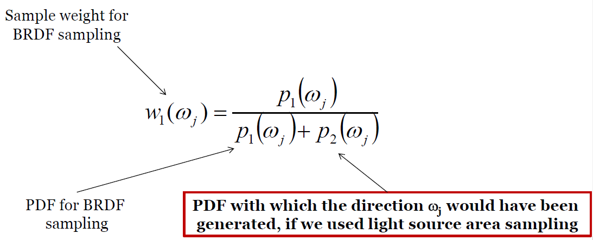
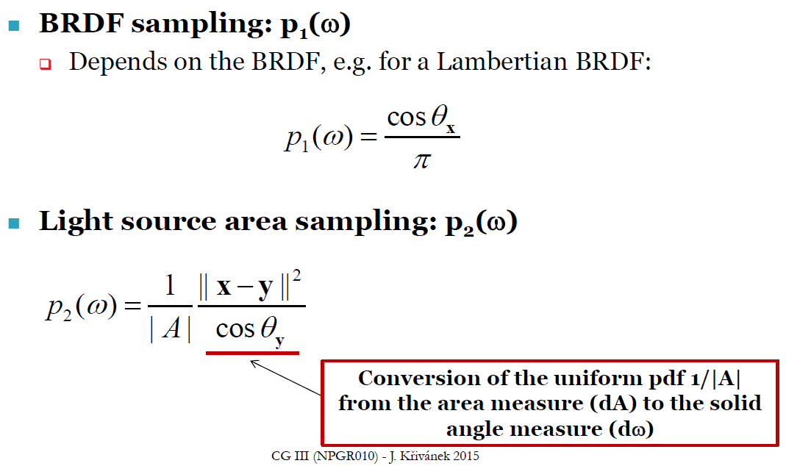
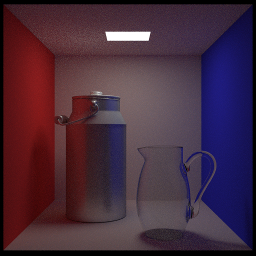
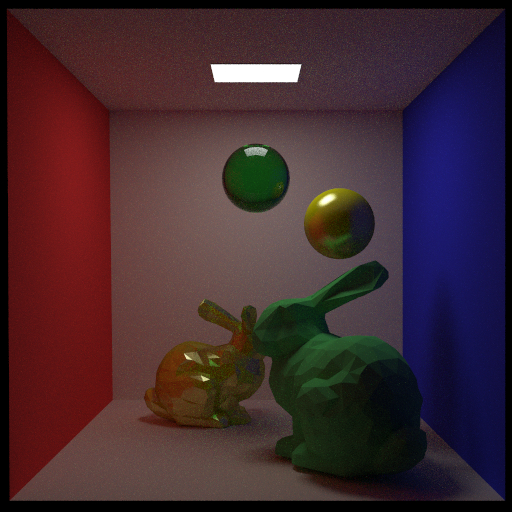
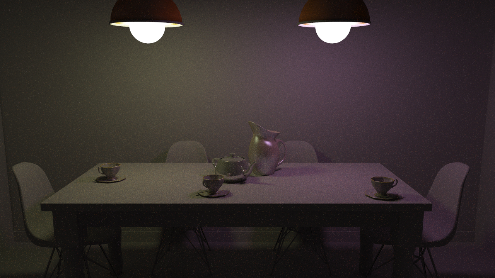
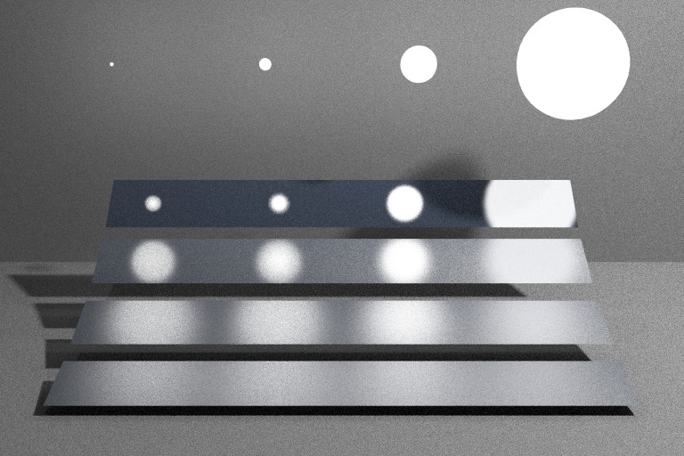

# Monte Carlo Path Tracer

## 环境
- window10
- vs 2017
- 第三方库
  - glm
  - [nlohmann/json: JSON for Modern C++](https://github.com/nlohmann/json) 
  
## 使用
若要修改测试内容，main文件的`tracer.traceScene("scene.json", 0)`中，scene.json是场景配置文件路径，0是场景index。
目前0是cbox，1是diningroom，2是veach，3是test scene。

## 实现
- scene load
  - 在读取场景部分，将场景参数写作json，使用nlomann json方便读取：
    ```josn
    {
      "name": "CornellBox",
      "root_path": "../scene/cbox/",
      "obj_path": "cbox.obj",
      "camera": {
        "position": [ 278, 273, -800 ],
        "look-at": [ 278, 273, -799 ],
        "up": [ 0, 1, 0 ],
        "fov": 39.3077,
        "film-resolution": [ 512, 512 ]
      } 
    },
    ```
  - 在载入obj部分，class `Model`存储obj中的mesh group、faces、verts等内容。根据材质参数，分类不同的材质类型。
  - scene包含Model，并从中提取直接光采样所需的emitters。
  - 一些修改：
    - cbox中顶部灯和天花板完全重合了，我下移了一些距离；
    - dinningroom场景中，view space中左下角的墙壁没用缝合，留了一条黑色的空隙，我在Maya里又修改了一下；
    - diningroom场景的fov应该是36；
- AABB
  - 在里面加入了和ray求交的内容；
- kd tree
  - 因为场景的面片树较多，所以在scene中建立kd-tree来求交；
  - 目前的树高为`4*round(log10((double)model->all_objs.size()))`；
- multi threads
  - 同样为了加速，尽量利用多线程并行计算，参考了[https://stackoverflow.com/questions/36246300/parallel-loops-in-c](https://stackoverflow.com/questions/36246300/parallel-loops-in-c)；
  - 不过，好像直接用openmp是一个更简洁快速的办法；
- primitive
  - 在基类object3d上派生triangle、sphere、box及对应的求交实现；不过因为现在是读取模型，目前只用上了triangle；
  - triangle: 具体的求交的矩阵推导和转换，详细参考了《realtime rendering》p748中关于三角形求交的内容；
  - sphere和box的求交，直接按照课堂slides实现；
- frame
  - 参考很多人的实现，class `Frame`好像是很常用的结构，方便坐标转换，在局部表面的采样和下表面方向剔除；
  - 在class `Hit`中存储一个Frame对象，记录intersect计算时，交点的局部坐标信息；
- spp
  - 为了取得一定结果又不耗费过长时间，下方测试的spp基本是50；
- sampler
  - 一开始的方案是`(double)rand() / RAND_MAX`，不过每次写都很冗余。为了方便生成随机数，使用封装的class `Sampler`，在需要随机采样的函数间传递引用对象；
- material importance sampling
  - diffuse
    - sample: 
      - Malley’s method: uniformly generates points on the unit disk and then generates directions by projecting them up to the hemisphere above it.
    - eval
        ```c++
        this->diffuse_reflection*Frame::cosTheta(hit.wi)*INV_PI
        ``` 
    - pdf: cos_theta*INV_PI 
  - Phong
    - sample
        ```c++
        double cosTheta = std::powf(sample.x, 1.0 / (exponent + 1));
		double sinTheta = std::sqrtf(std::fmax(1.0 - (cosTheta * cosTheta), 0));
		double phi = sample.y * 2.0 * PI;

		v = glm::dvec3(sinTheta * std::cosf(phi), sinTheta * std::sinf(phi), cosTheta);
        ```
    - eval
      ```c++
      this->specular_reflection*(exponent + 2)*INV_TWOPI*(double)std::powf(cos_theta, exp)
      ```
    - pdf
        ```c++
        (exponent + 2) * INV_TWOPI * std::powf(cos_theta, exponent)
        ```
    - 方法
      - 定义采样Phong的概率，这里用specular / (specular+diffuse);
      - 生成随机数r0;
      - 如果r0<p, 采样phong，反之lambert;
      - 联合PDFs: PDF=p*pdf_phong+(1-p)*pdf_lambert
  
  - glass
    - 计算菲涅尔系数，判断折射和反射，反射部分完全镜面反射
- MIS
  - light source sampling + BRDF sampling
  - 参考下述内容：
    - 
    - 


## 结果
- cbox:
    - 结果:
        
        - spp: 50
        - bounce depth: 10
        - direction illumination:
          - sample bsdf: 10
          - sample light: 5

- my scene:
    - 结果:
      
      - 参数：
        - spp: 50
        - bounce depth: 10
        - direction illumination:
          - sample bsdf: 10
          - sample light: 5
  
- diningroom:
    - 结果:
      
        - spp: 50
        - bounce depth:
          - Russian Roulette depth: 5
          - Russian Roulette probility: 0.95
        - direction illumination:
          - sample bsdf: 10
          - sample light: 10
  
- veach
  - 结果:
      
      - spp: 50
      - bounce depth:2
      - direction illumination:
        - sample bsdf: 10
        - sample light: 10